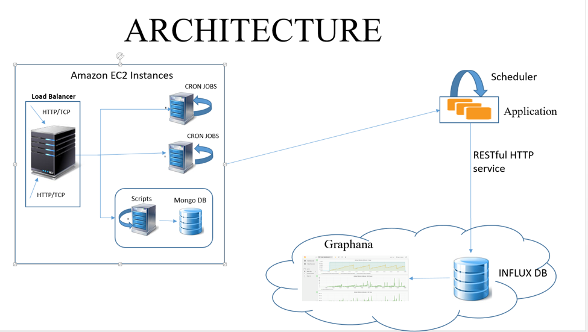

#Amazon EC2 Monitoring 

##Objective: 
This application is used to monitor EC2 instances on AWS.We monitor Ec2 metrics such as disk read/write, memory utilization and HTTP count. 

##Architecture:

##Installation and Execution:
###1.	Running the program from eclipse: 
1. Download all the java files into your workspace 
2. Download all the dependencies (Twilio and Mongo)
3. Install AWS SDK for JAVA from the link (https://aws.amazon.com/sdk-for-java/) 
4. Execute the program

###2.	Running the program from command prompt 
Download the jar
Set the working directory to the folder where the jar is present 
Open the command prompt and execute the following command 
java -jar awsDashboard.jar

##Monitoring Graphs 
Graphana front end is used for displaying the graphs. This connects to the Influx DB and fetches the latest value .The graph refreshes every five seconds to align to new value.The URL for graphana is https://gigawatt-mcfly-77.c.influxdb.com:3000/dashboard/db/amazon-ec2-monitoring-dashboard

##Influx DB
Influx DB is updated from our application every 5 minutes. The DB is available on cloud and can be monitored by accessing the https://gigawatt-mcfly-77.c.influxdb.com:8083/

## Additional Features

1. When the system utilization reaches its maximum value, then a message alert is sent to the user. 

2. Custom metrics are also monitored, Individual HTTP count on each instance is counted and reported to the mongolab and displayed as a seperate metric (Amazon Custom Monitoring) . Individual memory utilization is also monitored on each instance and displayed on the graph

3. Mobile app is also provided to monitor the metrics for user's convenience.
